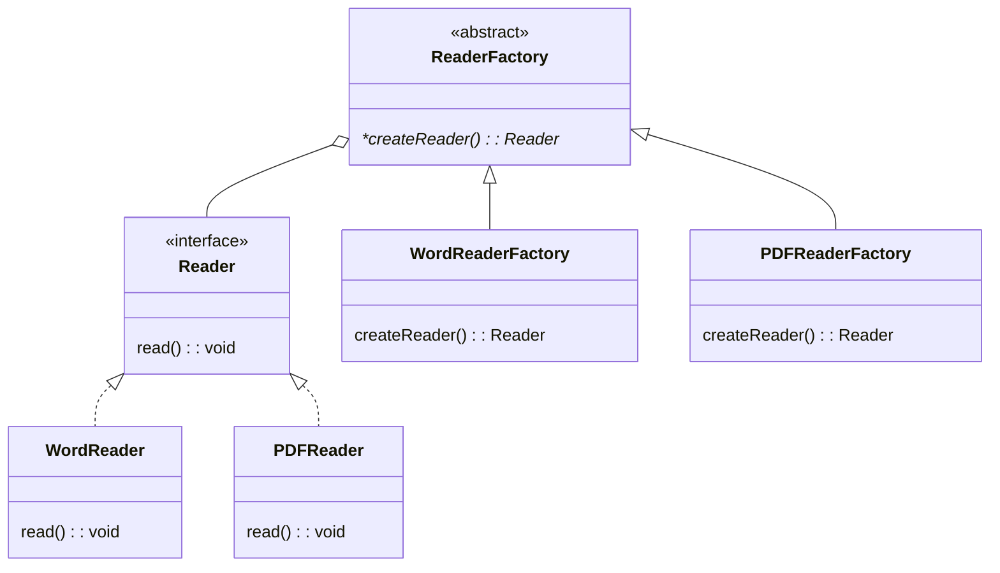

# Creational Patterns

**Memotechnique**: **S**i **F**abien **A**ppel, **B**ronche **P**as!

- **Singleton**:
    - Restricts the instantiation of a class to one single instance. 
    - This pattern ensures that a class has only one instance and provides a global point of access to that instance.
    ```java
    // Get the single instance of the Singleton class
    Singleton singleton = Singleton.getInstance();
    
    // Call a method on the singleton instance
    singleton.showMessage();
    ```

    ```mermaid
    classDiagram
        class Singleton {
            -static Singleton instance
            -constructor()
            +static getInstance() Singleton
        }
    ```

- **Factory Method**: 
    - Defines an interface for creating an object, allowing subclasses to alter the type of objects created using polymorphism. 
    - This pattern relies on inheritance, enabling subclasses to override the creation method.
        > thus promoting loose coupling and flexible object instantiation.
    > Unlike the "*Factory Method*", "***Static** Factory Methods*" do not involve subclassing. 
    > ***Static** Factory Methods* serves as an alternative to using constructors providing more control over the instance creation process.

    ```ts
    const wordFactory: DocumentFactory = new WordReaderFactory();
    const wordReader: Reader = wordFactory.createReader();
    wordReader.read(); // -> Reading Word document...

    const pdfFactory: DocumentFactory = new PDFReaderFactory();
    const pdfReader: Reader = pdfFactory.createReader();
    pdfReader.read(); // -> Reading PDF document...
    ```



- **Abstract Factory**: 
    - Provide an interface for creating **families** of related objects without specifying their concrete classes. 
    - It allows clients to create objects from multiple related classes through a single interface.
    - This pattern involves ***multiple* factory methods** for different products.
    > **Abstract Factory** has the same code base as the **Factory Method** Pattern.

    ```ts
    const wordFactory: DocumentFactory = new WordReaderFactory();
    const wordReader: Reader = wordFactory.createReader();
    const wordExporter: Exporter = wordFactory.createExporter();
    wordReader.read(); // -> Reading Word document...
    wordExporter.export(); // -> Exporting Word document...

    const pdfFactory: DocumentFactory = new PDFReaderFactory();
    const pdfReader: Reader = pdfFactory.createReader();
    const pdfExporter: Exporter = pdfFactory.createExporter();
    pdfReader.read(); // -> Reading PDF document...
    pdfExporter.export(); // -> Exporting PDF document...
    ```

    ```mermaid
    classDiagram
        class Reader {
            <<interface>>
            read(): void
        }

        class Exporter {
            <<interface>>
            export(): void
        }

        class WordReader {
            read(): void
        }
        Reader <|.. WordReader

        class PDFReader {
            read(): void
        }
        Reader <|.. PDFReader

        class WordExporter {
            export(): void
        }
        Exporter <|.. WordExporter

        class PDFExporter {
            export(): void
        }
        Exporter <|.. PDFExporter

        class DocumentFactory {
            <<abstract>>
            *createReader()*: Reader
            *createExporter()*: Exporter
        }

        class WordReaderFactory {
            createReader(): Reader
            createExporter(): Exporter
        }
        DocumentFactory <|-- WordReaderFactory

        class PDFReaderFactory {
            createReader(): Reader
            createExporter(): Exporter
        }
        DocumentFactory <|-- PDFReaderFactory

        DocumentFactory o-- Reader
        DocumentFactory o-- Exporter
    ```

- **Builder**: 
    - Separates the construction of a complex object from its representation so that the same construction process can create different representations. 
    - This pattern is used to construct a complex object step by step.
    - Typically involves a `Director` class that orchestrates the construction process and multiple `Builder` implementations that construct the object in different ways.

    ```java
        // Create a director
        Director director = new Director();

        // Instantiate the first concrete builder
        Builder builder1 = new ConcreteBuilder1();

        // Tell the director to construct the product using the first builder
        director.construct(builder1);

        // Retrieve the constructed product from the first builder
        Product product1 = builder1.getResult();

        // Call methods on the constructed product from the first builder
        product1.showDetails();

        // Instantiate the second concrete builder
        Builder builder2 = new ConcreteBuilder2();

        // Tell the director to construct the product using the second builder
        director.construct(builder2);

        // Retrieve the constructed product from the second builder
        Product product2 = builder2.getResult();

        // Call methods on the constructed product from the second builder
        product2.showDetails();
    ```

    - Alternative **without `Director`**:
        ```java
        // Using the builder to construct a Product object
        Product product = new ProductBuilder()
                            .setPartA("Part A")
                            .setPartB("Part B")
                            .setPartC("Part C")
                            .build();

        // Output the constructed Product
        System.out.println(product);  // Output: Product with Part A, Part B, and Part C.
        ```
        > This alternative lets the client build the product parts directly

    ```mermaid
    classDiagram
        class Builder {
            *+buildPart() void
            *+getResult() Product
        }
        class ConcreteBuilder1 {
            +buildPart() void
            +getResult() Product
        }
        class ConcreteBuilder2 {
            +buildPart() void
            +getResult() Product
        }
        class Director {
            +construct(builder: Builder) void
        }
        class Product {
            +showDetails() void
        }

        Builder <|-- ConcreteBuilder1
        Builder <|-- ConcreteBuilder2
        Director o-- Builder
        Builder --> Product
    ```

- **Prototype**: 
    - Allows cloning of objects without coupling to their specific classes. 
    - It involves creating new objects by copying an existing object, known as the prototype. 
    - This pattern is useful when object creation is costly or complex.

    ```java
    // Create an instance of the prototype
    Prototype prototype = new ConcretePrototype();
    
    // Clone the prototype to create a new object
    Prototype clone = prototype.clone();
    
    // Call methods on the cloned object
    clone.performAction();
    ```

    ```mermaid
    classDiagram
        class Prototype {
            <<interface>>
            +clone() Prototype
            +performAction()
        }

        class ConcretePrototype {
            +clone() Prototype
            +performAction()
        }

        class Client {
            +main()
        }

        Prototype <|.. ConcretePrototype
        Client --> ConcretePrototype : uses
    ```
