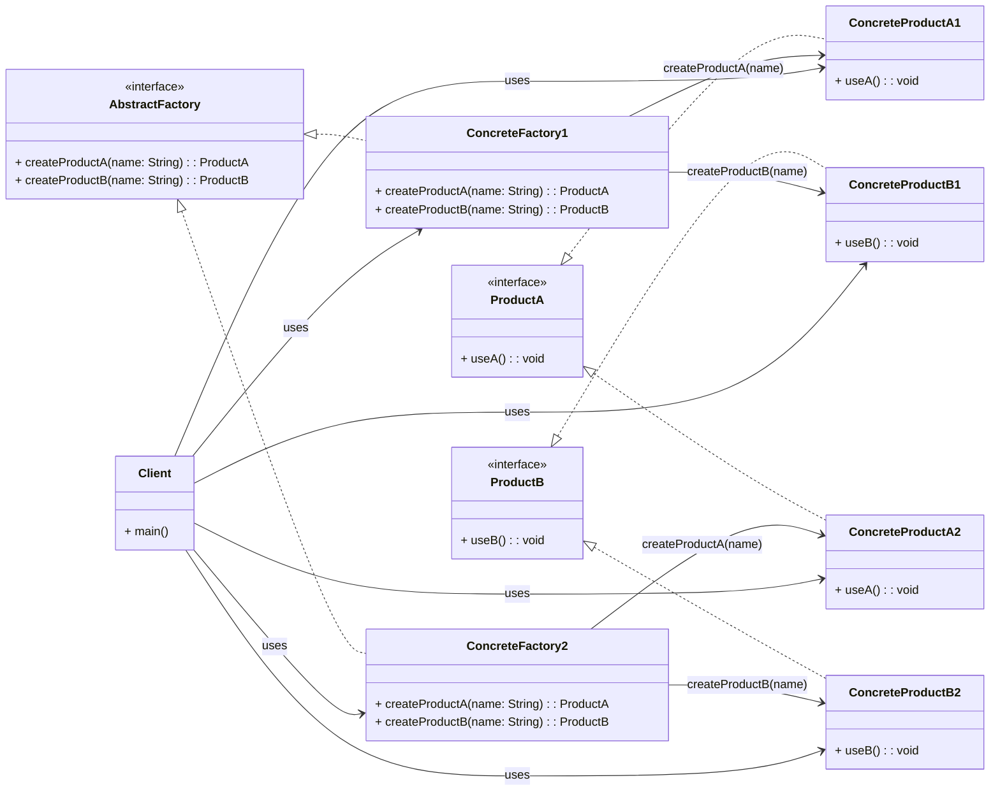

# Creational Patterns

**Memotechnique**: **S**i **F**abien **A**ppel, **B**ronche **P**as!

- **Singleton**:
    - Restricts the instantiation of a class to one single instance. 
    - This pattern ensures that a class has only one instance and provides a global point of access to that instance.
    ```java
    // Get the single instance of the Singleton class
    Singleton singleton = Singleton.getInstance();
    
    // Call a method on the singleton instance
    singleton.showMessage();
    ```

    ```mermaid
    classDiagram
        class Singleton {
            -static Singleton instance
            -constructor()
            +static getInstance() Singleton
        }
    ```

- **Factory Method**: 
    - Defines an interface for creating an object, allowing subclasses to alter the type of objects created using polymorphism. 
    - This pattern relies on inheritance, enabling subclasses to override the creation method.
        > thus promoting loose coupling and flexible object instantiation.
    > Unlike the *Factory Method*, ***Static** Factory Methods* do not involve subclassing. 
    > ***Static** Factory Methods* serves as an alternative to using constructors providing more control over the instance creation process.

    ```java
    // Create a factory for Word documents
    DocumentFactory wordFactory = new WordDocumentFactory();
    
    // Use the factory to create a Word document instance
    Document wordDoc = wordFactory.createDocument();
    wordDoc.open();
    
    // Create a factory for PDF documents
    DocumentFactory pdfFactory = new PDFDocumentFactory();
    
    // Use the factory to create a PDF document instance
    Document pdfDoc = pdfFactory.createDocument();
    pdfDoc.open();
    ```

    ```mermaid
    classDiagram
    direction RL

    class DocumentFactory {
        <<abstract>>
        *createDocument()* Document
    }

    class WordDocumentFactory {
        createDocument() Document
    }

    class PDFDocumentFactory {
        createDocument() Document
    }
    
    class Document {
        <<abstract>>
        *open()* void
    }

    class WordDocument {
        open() void
    }

    class PDFDocument {
        open() void
    }

    Document <|-- WordDocument
    Document <|-- PDFDocument

    DocumentFactory <|-- WordDocumentFactory
    DocumentFactory <|-- PDFDocumentFactory

    DocumentFactory o--> Document
    WordDocumentFactory o--> WordDocument
    PDFDocumentFactory o--> PDFDocument
    ```

- **Abstract Factory**: 
    - Provides an interface for creating **families** of related (or dependent) objects without specifying their concrete classes. 
    - This pattern allows clients to use products from different families without knowing their concrete classes.

    ```java
    // Create the first factory
    AbstractFactory factory1 = new ConcreteFactory1();
    
    // Use the factory to create products with arguments
    ProductA productA1 = factory1.createProductA("A1");
    ProductB productB1 = factory1.createProductB("B1");
    
    // Call methods on the created products
    productA1.useA();
    productB1.useB();
    
    // Create the second factory
    AbstractFactory factory2 = new ConcreteFactory2();
    
    // Use the factory to create products with arguments
    ProductA productA2 = factory2.createProductA("A2");
    ProductB productB2 = factory2.createProductB("B2");
    
    // Call methods on the created products
    productA2.useA();
    productB2.useB();
    ```



- **Builder**: 
    - Separates the construction of a complex object from its representation so that the same construction process can create different representations. 
    - This pattern is used to construct a complex object step by step.
    - Typically involves a `Director` class that orchestrates the construction process and multiple `Builder` implementations that construct the object in different ways.

    ```java
        // Create a director
        Director director = new Director();

        // Instantiate the first concrete builder
        Builder builder1 = new ConcreteBuilder1();

        // Tell the director to construct the product using the first builder
        director.construct(builder1);

        // Retrieve the constructed product from the first builder
        Product product1 = builder1.getResult();

        // Call methods on the constructed product from the first builder
        product1.showDetails();

        // Instantiate the second concrete builder
        Builder builder2 = new ConcreteBuilder2();

        // Tell the director to construct the product using the second builder
        director.construct(builder2);

        // Retrieve the constructed product from the second builder
        Product product2 = builder2.getResult();

        // Call methods on the constructed product from the second builder
        product2.showDetails();
    ```

    - Alternative **without `Director`**:
        ```java
        // Using the builder to construct a Product object
        Product product = new ProductBuilder()
                            .setPartA("Part A")
                            .setPartB("Part B")
                            .setPartC("Part C")
                            .build();

        // Output the constructed Product
        System.out.println(product);  // Output: Product with Part A, Part B, and Part C.
        ```
        > This alternative lets the client build the product parts directly

    ```mermaid
    classDiagram
        class Product {
            +void showDetails()
        }

        class Builder {
            -Product product
            +void buildPartA()
            +void buildPartB()
            +Product getResult()
        }

        class ConcreteBuilder1 {
            +void buildPartA()
            +void buildPartB()
            +Product getResult()
        }

        class ConcreteBuilder2 {
            +void buildPartA()
            +void buildPartB()
            +Product getResult()
        }

        class Director {
            +void construct(Builder builder)
        }

        class Client {
            +main()
        }

        Builder <|-- ConcreteBuilder1
        Builder <|-- ConcreteBuilder2
        Director --> Builder : uses
        Client --> Director : constructs
        Client --> ConcreteBuilder1 : uses
        Client --> ConcreteBuilder2 : uses
        Client --> Product : interacts
        Builder --> Product : builds

        ConcreteBuilder1 ..> Product : builds
        ConcreteBuilder2 ..> Product : builds
    ```

- **Prototype**: 
    - Allows cloning of objects without coupling to their specific classes. 
    - It involves creating new objects by copying an existing object, known as the prototype. 
    - This pattern is useful when object creation is costly or complex.

    ```java
    // Create an instance of the prototype
    Prototype prototype = new ConcretePrototype();
    
    // Clone the prototype to create a new object
    Prototype clone = prototype.clone();
    
    // Call methods on the cloned object
    clone.performAction();
    ```

    ```mermaid
    classDiagram
        class Prototype {
            <<interface>>
            +clone() Prototype
            +performAction()
        }

        class ConcretePrototype {
            +clone() Prototype
            +performAction()
        }

        class Client {
            +main()
        }

        Prototype <|.. ConcretePrototype
        Client --> ConcretePrototype : uses
    ```
